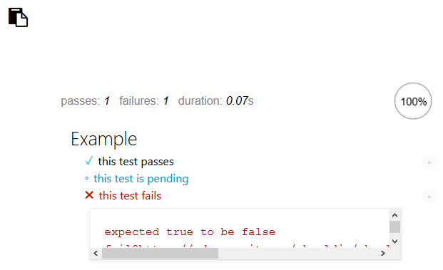
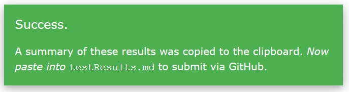

# client-side-js-tests

This repo is designed for use as a [git submodule](https://git-scm.com/book/en/v2/Git-Tools-Submodules) in other repos for student assignments.

After the instructor has set up an assignment repo with this submodule, students load `runTests.html` in a browser to run the instructor's tests against their work.



Students submit a summary of their test results by clicking the `Copy` icon in the upper left corner of the page. This automatically places a summary of the test results on the clipboard. Then, as the feedback message indicates, students paste into a file named `testResults.md` and save it. When students commit and push work to GitHub, the results file will be included.



## Setting up the assignment

Before a given assignment repo is provided to students, the instructor must modify `runTests.html` as follows.

Replace the example `<script>` tag below with tags for the `.js` files that should be tested.
```
  <!-- Load your external script(s) containing the code under test. -->
  <script src="./Example.js"></script>
```
Replace the example `<script>` tag below with tags for the `.js` files contain the `mocha` tests.
```
  <!-- Load your external script(s) containing the mocha tests. -->
  <script src="./test/Example.js"></script>
```
Optionally, change the variable below. When set to true, the summary that is copied to the clipboard will use emojis to indicate test outcomes; this renders nicely on GitHub.com. When set to false, emojis are replaced with HTML entity symbols, which are less informative but more portable.
```
  <!-- Feature toggle: use GitHub-flavored markdown? -->
  <script>
    var useGHFM = true; // eslint-disable-line no-unused-vars 
  </script>
  ```
